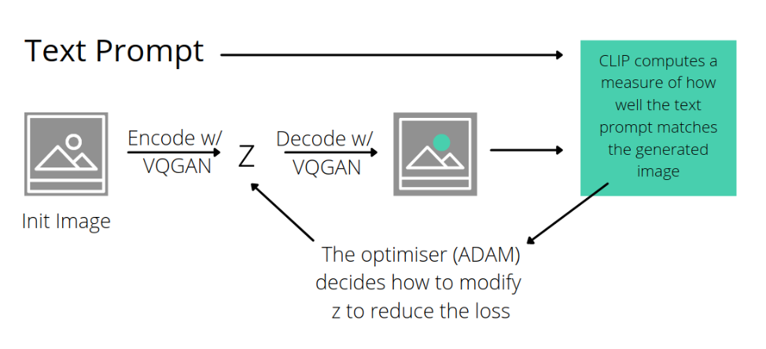

# Final-project: Bob Dylan lyrics and image generator
This project is trying to generate Bob Dylan's style of lyrics and then generate a image based on these lyrics.

For the lyrics generator,I applied NLP based on LSTM and trained a Bidirectional LSTM model and for the image generator I used a pretrained model called CLIP,which is trained with an image encoder and a text encoder simultaneously on a dataset of 400 million (image, text) pairs collected from the internet and then combined with another pretrained model called VQGAN.

***
### Tutorial:
This project is based on a lot of great tutorials I found online.

:point_right:tutorials for **NLP**  :*[NLP](https://www.youtube.com/watch?v=ZMudJXhsUpY)*.

:point_right:tutorials for **image generator** : *[AIAIART](https://www.youtube.com/watch?v=dWCM-_V4hz8&list=PL23FjyM69j910zCdDFVWcjSIKHbSB7NE8&index=3)*.

***
### The data resource:
The lyrics data is collected from *[Kaggle](https://www.kaggle.com/datasets/terminate9298/songs-lyrics?select=lyrics.csv)*.

***
### Network Architecture:
:point_right:The **NLP network** has the following architecture: Input -> Embedding layer -> Bidirectional LSTM layers -> Dropout layer -> another LSTM layers -> Fully Connected Linear Layer -> Output

:point_right:The structure of **CLIP+VQGAN model** is as below:

***
### Streamlit:
After training the model, I set it up with simple web interface using *[Streamlit](https://streamlit.io/)*.